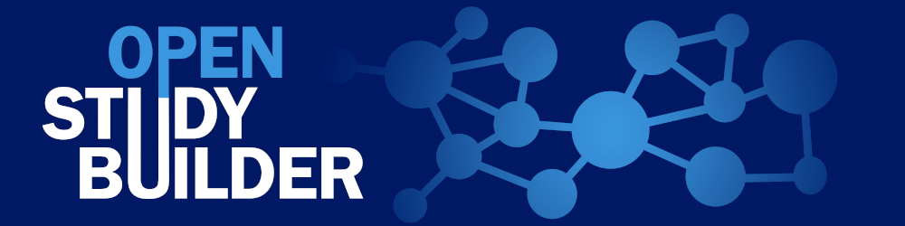
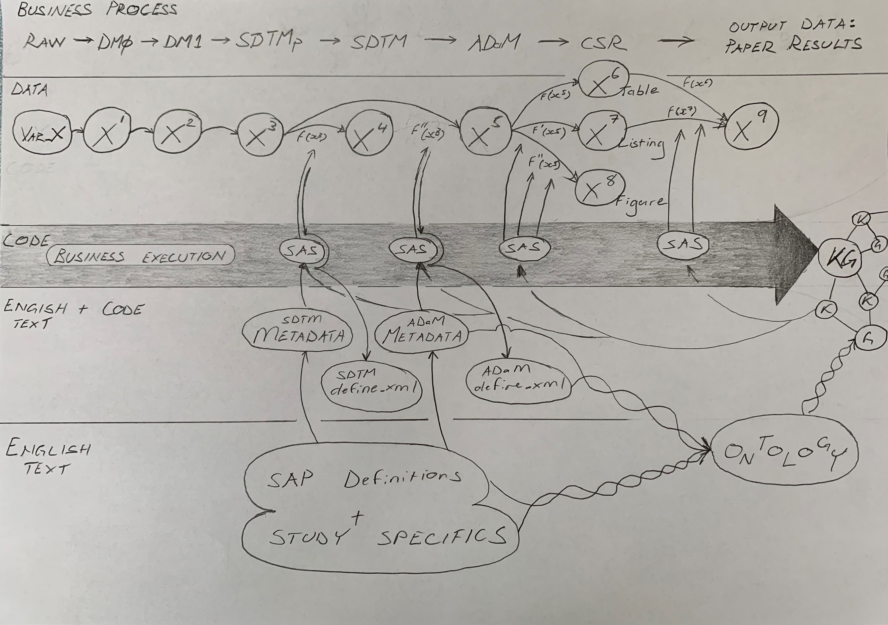

## Disclaimer
 
Neither I nor my employer receive any payment or benefits from Verisian.
 
 
The written and expressed views in this presentation are entirely those of the presenter; they are not intended to be representative of my employer, Bayer Aktiengesellschaft.

::: {.notes}
- I'm not getting paid by Verisian nor am i incentivized in any way to promote their company or products.
- This presentation is made by myself and on behalf of myself.
- Opinions are my own and not those of my employer, Bayer.
- Just on opinions - that's all they are. I'm a scientist with a back ground in genomics and biomarkers.
- And though I'ved worked to ensure my opinions align with facts and other observations...
- If you think I'm getting something wrong then please call me out in the Q&A for both my and the audiences benefit. - There's a lot I'm still learning after 7 years or so in the industry.
:::

## Contents
 
 

### I.   Introduction
### II.  Inflection [[pivot]]{.yellow}
### III. Building the Future: upgrade the engine while the car is driving

::: {.notes}
- structure of what I'll take us through over the next 30mins
:::

# I. Introduction [[context]]{.yellow}

::: {.notes}
- First we need context.
:::

## Why are we here?
 
To [communicate]{.yellow} our quantitative measures of therapy safety and efficacy in patients to third parties for evaluation of health value.

. . . 

 
 
[To change for the better how we do this.]{.yellow}

::: {.notes}
- I want to take a few moments to linger on the 'why' of why I'm asking you for 30mins of *your* time today.
- I'll be talking around the topic of statistical programming processes today.
- But it's important to remember what the whole drug-development endeavour is about:
  - making medicine that helps people, and...
  - being able to *communicate* to those charged with safeguarding peoples health and well being, the facts and many details about how  effectively our medicines work and so forth
- And! To see how we can *change* this process for the better, or *improve* it.
- The deliverable of this persentation is to convince you there is a better way to get statisitcal programming done, and, 
- *to motivate you and your team, your entire company, to take action today!*
:::

## This is personal 

 
Statistical Programming Analyst:
 

::: columns
::: {.column width="60%"}
Surya [[SAS ninja]]{.yellow}
:::

::: {.column width="35%"}

:::
:::

::: footer
Image credit: https://easy-peasy.ai/
:::

::: {.notes}
- To Do
:::

## This is personal 

 
Statistical Programming Analyst:
 

::: columns
::: {.column width="60%"}
Surya [[SAS ninja]]{.yellow}

Works with a mountain of SAS code...

:::

::: {.column width="35%"}

:::
:::

::: footer
Image was created with the assistance of DALL·E 2
:::

::: {.notes}
- To Do
:::

## This is personal 

 
Statistical Programming Analyst:
 

::: columns
::: {.column width="60%"}
Surya [[SAS ninja]]{.yellow}

Works with a mountain of SAS code...

To deliver a [Clinical Study Report]{.yellow}
:::

::: {.column width="35%"}

:::
:::

::: footer
Image was created with the assistance of DALL·E 2
:::

::: {.notes}
- To Do
:::

## Surya's Challenges in 2024

### Legacy Processes: 2024 or 1994? [[as-is]]{.yellow}

a. Data Storage
b. Data Transformation
c. Processes: the solo programmer & double programming
d. Silo everything: challenges unique to the Domain (data privacy):
 
   Data and code and tools are closed source
<!-- :wave: -->

::: {.notes}
- First: there is the data. This typically arrives at Surya's teams desks as flat-files of tables locked up in a proprietary file format like sas7bdat archive files. And not just one file, but many. And not with unique feature or variable sets but with redundancy. And with a set of variables or 'data models' which differ between studies and over time.
- Countless hours have been invested to create standards to ease interoperability across studies, teams companies and so forth: CDISC Analysis Data Model (CDISC - ADaM) and Study Data Tabulation Model (CDISC - STDM)
- Where are these files stored? Probably on a network file share. In a mostly, but entirely, standardised (but arcane) folder hierarchy. Invented by a sys-admin who knows linux, but not UX.
- Surya will need some days, or weeks, to familiarize her self with the mere structure of the study data.

- Second: there is what we do to the data. Surya transforms some variables from one format to another according to a set of specifications another team drafted. This may be units of measurement, different international standards for certain data types like dates, and so forth. In computer science this might be akin to the 'T' for 'transformation' in the ETL process. Some excellent software developed for ETL applications. But manual writing and maintenance of SAS code is not one them!
- Surya will toil for some days or weeks on the code that manages the transformation of the clinical trial data her team is supporting.

- Third: Surya will deal with the first two challenges alone. That is, navigating the study files on the network drive, the countless SAS programs and macros already written, and of course writing what ever changes, updates or new SAS programs are defined in the documentation for this specific study, like the Statistical Analysis Plan or SAP.
- On top of doing this alone, a second human will re-write, from scratch much or all of the code Surya wrote to create the tables, listings and figures for the CSR. If both programmers code produce the same out-put it means that they either both did it correctly, or they both made the same mistake. Fair enough, it's almost always the correct out come. But it's a lot of energy with no gain beyond a consensus is programming.

- Fourth and last in my misery-list are challenges unique to the domain of itself. Namely data privacy owing to the source of the data: us. These are measurements about our most intimate selves. I'm a pretty person but even I'm not comfortable advertising certain measurements of my body. No doubt your the same. This means a LOT of resources are invested to ensure clinical data is held under strictly enforced access controls.
- Stewart Brand (no relation) was quoted: "Information wants to be free". It seams he was not referring to clinical data.
- In contrast to the virtues of the open-source movement which has delivered much of the tooling needed to build, arguable, humanities greatest achievement to date - the internet - the justifiable siloing of clinical data has seeded the approach I think, that *everything* around it should also be carefully guarded and locked away: the code we write to do the data processing, the langauge we use to write the code (still mostly SAS), the systems we use, Oracle, SAP and so forth. So before a single byte of patient data arrives, we've spent many millions of dollars on hidden technologies to support our work with it. A closed shop.
- Good luck Surya learning how to work with these systems in University. More likely she is learning on the job, subtracting her time to learn from the bottom line of her company and adding to the waiting time for a patient in need of the medicine.

- so that's the bad and the ugly of clinical programming in 2024.

-But I'm an optimist, and see the solutions all around us... namely from the software development industry. Because, you know, they write code to do useful, or at least valuable things for all of us, like letting me speak from the comfort of my home office to all of your selves, in real time!

:::

## Learn from the best

### The software dev / tech industry [[to-be]]{.yellow}

a. Version control: code *and data*
b. [Agile development methods]{.yellow}: collaboration and iteration
c. Openish source: democratize the tools and processes that we use to make money with, not from.
  *SAS macros anyone?*
    
    And make our data accessible to anyone who can add value:
    data scientists, shareholders, regulators, at any-time, any-how. *Blockchain anyone?*

::: {.notes}
- although mainstream software dev doesn't need to worry about audits from regulatory authorities, or harm coming to patients, there are some pretty obvious tools that clinical programming from day 1 of go live:

- First: let's let the machines look after versioning our code. Yes, SVN or perhaps Git is in place in companies, but statistical programmers are typically not committing, branching and merging the code they write. SAS code is still written more like a word document on a university students PC, using directory and file names to indicate code history and maturity.
- The same is true for data in my experience. What else would Surya expect from using files to store data. Even if we were insane we could get these 'files' into a git repo and improve the management of our data and clinical study progress to completion. I'm half joking, just snap-shotting any common relational database would provide large efficiency gains from process perspective. These products are available today, e.g. TerminusDB, Dolt and LakeFS look very interesting.

- Agile development: this is a pet love of mine. Developers have been writing code since before most of us were born. It's a hard job, but after 50 years these clever people have worked out some pretty effective ways to generate the highes quality code with as little time and energy as possible.
  - pair programming
  - test driven development
  - sprint cycles: iteration, iteration and more iteration!
  - stand ups
  - code reviews
  - back log refinements
  - story board estimates
- it all works!
- stat programming is really missing a lot merely not embracing current software dev best practices... *especially* given the pressures of the regulatory environment.

And third is a mind-set shift around our main assets. Keeping our compound structures and synthesis processes secret and under patent should remain so. But the data we receive from our patients realizes new value in the 'data is the new oil' economy. <To Do>

:::

# II. Inflection  [[pivot]]{.yellow}

::: {.notes}
- I've described to you the head-winds that drag at stat-programmer, Surya's efforts to deliver the documentation thgat initiates the communication with regulatory authorities. 
- I've offered a first pass of the many things Pharma could have been using for more than a decade now.
- And remind us it's not too late to start implementing one, some or all of these today.
- So what's holding us back?
:::

## Impediments to change

<!-- ::: {.incremental} -->
a. Incumbents: legacy technologies and infrastructure 
b. Mindset: lethargic and closed [source]
c. Generation change
d. Existant SAS code: [highly complex]{.yellow}
e. Motivation
 
 
  *"Change happens when the pain of staying the same is greater than the pain of change"* &emsp;&emsp;&emsp;&emsp;&emsp;&emsp;-Tony Robbins

<!-- ::: -->

::: {.notes}
- So before we lean into the change, here some points to mindful about where might find resistance.

- first are the incumbents and the sunk cost they've incurred. Over the last quarter century or so hundreds of millions have been plouged into building and maintaining the SAS pipelines that Surya and her team use to create TLFs. The external companies and internal stake-holders that support this are incentivised to keep doing so. They want to keep doing what they know how to do. Learning new tricks get's harder the longer you keep doing the same thing. 

- Next is the industries legacy of being closed source. The silo everything mentality works against change and innovation. Whatever we do, we typically do alone because of the pervading atmosphere of 'don't tell any one'.
- So except for cross industry organisations like PHUSE and CDISC we largely miss the collective intelligence of developers exchanging and building on great ideas to advance the field.
- Lethargy pervades teams: get the work done, don't create more by trying to innovate.

- So unlike other less profitable industries we see a rate of change yet matching our species: only the younger generation, with newer experiences and views on the world who are given the opportunity to lead will make the changes required for improvement.
- The reality is that managers in large companies with high salaries and benefits are incentivised to stay in place and not try to fix what isn't broken.

- The fourth point is a doozy: the sheer volume and interdependent architecture of a typical phase 2 or 3 study is something to behold. If you could behold it. Because as of today there is no tool available you can point to a study code base which will describe, in total, the dependency tree, or map of every single clinical variable or feature.
- Macros nested within macros nested within macros, tables inner joined, outer joined, left and right joined from multiple files containers.
- Is it any wonder stat programming pays as well as it does to have a human understand this?

- <To Do> Note that I said 'until today'. We'll come back to this.

- Last point, let's be honest: energy is only spent when the motivation is sufficient.
:::

## What can and should we do today?

::: columns
::: {.column width="30%"}

:::

::: {.column width="70%"}
Accept the [as-is]{.yellow}:
 
a. Work with what we've got 
   
b. Commit what's need to change, i.e.
   
  time, money and people.
   
   
*Objective judgement, now, at this very moment. Unselfish action, now, at this very moment. Willing [acceptance]{.yellow} - now, at this very moment - of all external events. That's all you need.* &emsp;&emsp;&emsp;&emsp;&emsp;&emsp;-Marcus Aurelius 
:::
:::

::: {.notes}
- I would have thought these two points are obvious.
- But from those making the decisions with access to the big budgets, I'm not seeing the evidence that these 2000 year old points have been grasped...

- Now, lets what do I propose we can and should we do today to narrow the gap between the as-is and to-be.
:::

# III. Building the Future: upgrade the engine while the car is driving

::: {.notes}
- Now, while we are building and deploying stat programming 2.0, Surya *must* continue to churn out TLFs and so forth as usual. We need a way to swap out the old petrol engine with a new electric/battery drive train: while the vehicle is moving.
:::

## Get a handle on our data and code: [over]{.yellow}lay a semantic data model on existing data and code

<!-- ## {auto-animate=true} -->
a. Data + Code: distilled to its essence it's ETL, *so let's do it properly*
b. Previous efforts to build an ontology:
 
*top down*, from standards

## Get a handle on our data and code: [over]{.yellow}lay a semantic data model on existing data and code

::: columns
::: {.column width="65%"}

:::

::: {.column width="35%"}
- Knowledge graphs add relationships or *edges* to data points or *nodes*
- This enables one to *traverse* the *topology* of the database
:::
:::

::: footer
Image credit: https://novo-nordisk.gitlab.io, Novo Nordisk, OpenStudyBuilder
:::

::: {.notes}
- So here I've taken an example knowledge graph implementation of clinical data data standards and concept.
- <zoom-in> Ctrl + mouse click.
- Yellow CT code list 'VSTEST' => Orange CT term 'Weight' => Green 'ActvityClass' => light green 'VariableClass' => Blue 'Variable' => Vital Signs, which belongs to the Blue 'Dataset', and which is of the 'DataModellIG'
- As we'll see, overlaying an entire study with a semantic data model delivers enormous power and flexibility for managing the interdependancies of clinical data within and across studies.
:::

## No free lunch {auto-animate=true}
 
 
Building an ontology and semantic model for clinical trials is highly specialized and deeply [labor intensive.]{.yellow}

<!-- {.absolute bottom=30 right=-20 height="170"} -->

::: footer
Image credit: https://novo-nordisk.gitlab.io, Novo Nordisk, OpenStudyBuilder
:::

::: {.notes}
- It's an enormous amount of work, which will depend on teh collaboration and agreement of the industry around standardized terminology for the ontology. 
- Just a side note: in genomics domain useful knowledge graphs have been assembled to represent gene and protein functions and inter-relationships. Many computational laboratories have collaborated now for decades to achieve such value and usability.
- The OpenStudyBuilder is doing hands down the best job I've seen so far to develop a top down approach for our industry, not least in taking a fully open source approach for the core technology to enable collaboration and contributions across and beyond our industry - since many non-pharma software devs will be needed. Great team. Disclosure: one of the main contributors, Katja Glass is a Bayer employee, although she is doing this independently of her role at Bayer.
:::

## No free lunch {auto-animate=true}
 
 
Building an ontology and semantic model for clinical trials is highly specialized and deeply labor intensive.
 
 
If we want to be faster we'll need a different approach:
 
[Build it *bottom up*, from the code.]{.yellow}
 
 
Not only faster, there's more...

::: {.notes}

:::

## How bottom up?

::: columns
::: {.column width="65%"}

:::

::: {.column width="35%"}
  - *top down* places human text at the top of the process, defining standard ontologies etc.
  - *bottom up* places executed machine code at the top, of the process, form which standards are defined
:::
:::

::: {.notes}
- summarize existing 'top down' approach.
- describe briefly the reverse, 'bottom up' approach.
- Now for the highest value part of my presentation:
  - *why* bottom up built knowledge graphs will rule the pharma world
  - And solve all of Surya's problems!!
:::

## Bottom up *Knowledge Graphs*: [under]{.yellow}pin a sematic data model on existing data and code

a. Not lost in translation: [code is _the_&nbsp;&nbsp;business execution]{.yellow} that delivers value (not the so much the other stuff)
b. Works with _all_&nbsp;&nbsp;previous and current code
c. Machines parse the code and deterministically extract all process logic

::: {.notes}
- point a.: The executed code is what is creating the business deliverable: the TLF's that Surya is creating as teh key to bringing  adrug to markjet.
- Much less so the documentation and meta-data standards, SAPs and so forth, which should be based on the code anyway (and mayb not the other way round)
- point b.
- point c. segue to next slide
:::

## Deterministically read machine parsed code

<!-- ::: {.incremental} -->
a. deterministic vs probablistic
a. Fully automate the graph creation
b. 100% explainable, no halucinations
c. Universal code logic extraction
<!-- ::: -->

::: {.notes}
- For deterministic models, the output of the model is fully determined by the input parameters and data, whereas probabilistic models incorporate randomness in their approach. Consequently, the same set of parameter values and initial conditions can and will lead to different outputs, even as the input remains unchanged.
- Another way to think of it is black box vs clear box.
- So we can be *traceable* sure of what's going on using this approach.
- This is *not* the case using LLM's
- So you already know where LLM's probably (or absolutely) should not be used

- b. Obviously, When a machine is doing, we can immedaitely begin to automate. Versus the army of human ontology specialists we'll need for the top down approach.

- c. related to a. and what i mentioned before: where talking fully explainable processes.
- ie. clear box, not black box.

- d. You know exactly what you code is doing, which then feeds... segue...
:::

## Single source of truth feeds other processes

a. Documentation creation: definitions and descriptions for [humans]{.yellow}
b. Translate to other languages: R, Python  break out of the SAS *minima* :wave:
c. Breaking changes: [end-to-end tracability]{.yellow} with a complete dependency map 

::: {.notes}
- With precise code logic comes autmomated documentation creation.
- And with LLMs, which don't need to be determinsitally perfect when it comes ot grammar, they now come into the picture.

- point b.: something use 'R' s and Pythonistas like myself will like: using the code logic to aumotically port the SAS code to R, python and pretty much any open source language!
- shhh: don't tell your SAS contract manager. Seriously, where not trying to replacce SAS, but if you wanted too, this would make it so much easier!

- point c. we bascially covered
- won't Surya be happy she doesnt have to dig through 10 year old code from a colleague who left 9 years ago and wasn't very generous in commentin ghis code!
:::

## But wait, won't LLMs deliver our golden future (and replace humans)?

a. In short no, because they are probabilistic and determinism is at the heart of drug development (esp back translation)
b. But they will be useful for support tasks

::: {.notes}
Speaker notes go here.
:::

## LLMs will accelerate human efforts (nothing new, but let's run through the existing list)

a. Draft text creation: e.g. CSR
b. Draft code documentation
c. Draft code creation
e. Natural language interface to tabular and relational database stores
f. Synthetic data creation (to liberate clinical data from Silos)

::: {.notes}
Speaker notes go here.
:::

## Summary

## Acknowledgements (?)
Tomas Sabat Stöfsel for opportunity, thoughts on communication and double programming
Slide Theming Emil Hvitfeldt https://emilhvitfeldt.com

::: {.notes}
Speaker notes go here.
:::

## Notes

::: {.notes}
Follow up talk? Liekly only wetted your appetite, though hope there was enough to get you going.

Deliverable: motivate to action:
Motivate you and your team, your entire company to take action today:
 
*Go get after it!*

Tamr - as next level ETL

First mention of TLF: where shoudl it bne? Make it emphasized
:::
